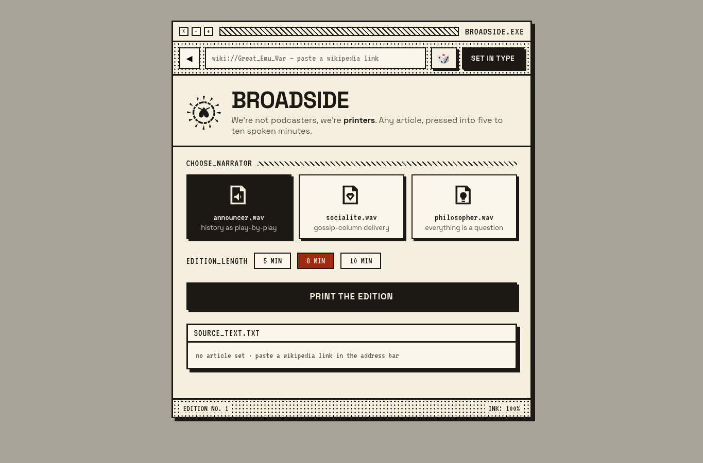

# 🎙️ BROADSIDE.EXE — Wiki Persona TTS

A retro, high-fidelity web application that presses any Wikipedia article into a polished spoken audio monologue using OpenAI and ElevenLabs. 

Originally built as a **Sauna App**, this is a complete, single-file serverless backend + vanilla frontend stack designed to run on Cloudflare Workers / Sauna Apps runtime or any standard edge handler.



## 🌟 Features

- **Three Curated True-Crime Profiles**: Hardcoded dice 🎲 that cycles through infamous true-crime histories (`Kenneth_McDuff`, `Luka_Magnotta`, `Joseph_James_DeAngelo`, etc.) — or you can paste any custom Wikipedia address.
- **Three Narrator Voices**:
  - `announcer.wav` — High-energy vintage radio play-by-play (read by **Daniel** on ElevenLabs).
  - `socialite.wav` — Conspiratorial, gossipy retro delivery (read by **Jessica** on ElevenLabs).
  - `philosopher.wav` — Thoughtful, slow-paced contemplative delivery (read by **Bill** on ElevenLabs).
- **Variable Lengths**: Choose between **5 min / 8 min / 10 min** editions (targeting 150 words per minute).
- **Automatic Audio Chunking**: Seamlessly breaks down script segments exceeding ElevenLabs' 5,000-character request cap, generates parallel TTS buffers, and merges them server-side into a single high-quality MP3 stream.
- **Retro Terminal Styling**: Fully responsive CSS mimicking a vintage `.exe` desktop window with tactile paper colors, custom dot grids, animated SVG icons, and a streaming "PRESSING..." printing animation.

## 🛠️ Stack

- **Frontend**: Single self-contained HTML `public/index.html` (zero-build, vanilla JS + custom responsive CSS).
- **Backend**: Edge-native handler `src/handler.ts` (using pure web standards, runs on Cloudflare Workers or Sauna Apps).
- **APIs**: 
  - Wikipedia summary (`api.rest_v1`) + full text extracts (`w/api.php`)
  - OpenAI Chat Completions (`gpt-4o-mini`)
  - ElevenLabs Text-to-Speech (`eleven_turbo_v2_5`)

---

## 🚀 Running on Sauna

To deploy this app directly to your Sauna Space:

1. Clone or copy these files into your Sauna workspace under `apps/wiki-persona-tts/`.
2. Connect your **OpenAI** and **ElevenLabs** accounts in your workspace.
3. Run `app_deploy` with the following configuration:

```json
{
  "slug": "wiki-persona-tts",
  "accounts": [
    { "app": "openai", "id": "conn_pd_apn_YOUR_OPENAI_ID", "name": "OpenAI" },
    { "app": "elevenlabs", "id": "conn_pd_apn_YOUR_ELEVENLABS_ID", "name": "ElevenLabs" }
  ],
  "connections": []
}
```

---

## 💻 Local Development / Manual Deploy

To adapt this to standard Cloudflare Workers or a Node edge handler:

1. Install wrangler: `npm install -g wrangler`
2. Configure your `wrangler.json` to route `/generate` and `/random` to `src/handler.ts` and serve `public/` as static assets.
3. Add your `OPENAI_API_KEY` and `ELEVENLABS_API_KEY` as worker secrets:
   ```bash
   wrangler secret put OPENAI_API_KEY
   wrangler secret put ELEVENLABS_API_KEY
   ```
4. Adjust the `fetch` calls in `src/handler.ts` to read keys from `env.OPENAI_API_KEY` and `env.ELEVENLABS_API_KEY` instead of relying on Sauna's proxy injection.

## 📄 License

MIT License. See [LICENSE](LICENSE) for details.
